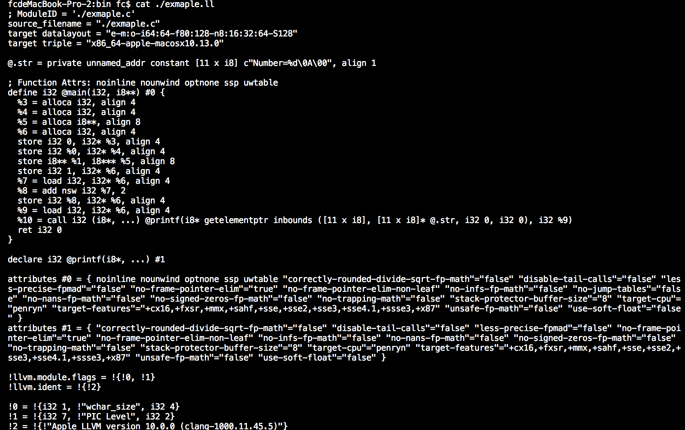
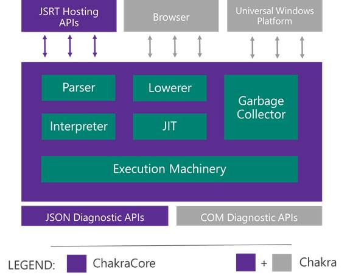

## 必备工具

  clang ,Python 


## 二进制编译原理

  本节深入理解编译原理的各个部分,旨在于了解程序编译过程中编译器或脚本解析器做了哪些事情和实现细节,如果我们要在编译过程中进行Fuzzing 应该要怎么做.

  我们知道,计算机的CPU 通过执行二进制的代码来计算程序的结果.人类编写的各种计算机语言,事实上是人类对语言的约定,我们应该要按照这种办法来编写代码,程序也应该按照人类的规划的方式来执行.这些文本代码经过编译器编译后,会翻译成机器可以执行的二进制代码,期间编译器做的工作包括:语法分析,对代码构建抽象语法树,编译成目标平台的汇编代码,链接生成程序.接下来就用clang 来一步步分析.

  clang 是基于LLVM 的编译器,编译时的过程如下:


1. Clang Frontend(Clang 前端)部分主要的工作是对代码进行序列化为抽象语法树再编译成LLVM IR 
2. LLVM Optimizer(LLVM 优化器)对LLVM IR 进行优化或者混淆,接下来每个.c /.cpp 文件就会成为.o 文件
3. LLVM Linker 对编译出来的.o 文件进行链接,合并所有.o 的代码并引入这些代码所需要的静态库代码和动态链接库的函数符号
4. 最后根据目的平台的架构进行代码生成,输出二进制文件.

  同样的原理深入GCC 的编译过程:

1. GCC 首先调用**cpp** 把.c/.cpp 的宏处理好,生成.i 文件
2. 把预处理过后的.i 文件传递给**cc** 来编译汇编代码到.s 文件
3. 然后GCC 把汇编文件传递给**as** 生成.o 文件
4. 最后通过**ld** 来链接所有的.o 文件输出可执行程序


### AST (抽象语法树)

  在编译器前端对文本代码进行解析时,目的就是为了对程序代码生成程序可以处理的树状结构,称之为抽象语法树.下面是一个例子:

```c

#include <stdio.h>

int main(int argc,char** argv) {
    int number = 1;
    
    number += 2;
    
    printf("Number=%d\n",number);
    
    return 0;
}

```

  我们可以使用Clang 对上面的代码生成AST ,命令如下

```shell

clang -Xclang -ast-dump -fsyntax-only exmaple.c

```

  输出的结果较多,在此只取一部分显示结果


  在Python 下我们可以使用内置的AST 库来对代码构建抽象语法树

```python

import ast

node = ast.parse('a = 1')

ast.dump(node)

```

  在 `ast.dump()` 输出下可以看到JSON 格式的AST 树数据

```txt

>>> ast.dump(node)
"Module(body=[Assign(targets=[Name(id='a', ctx=Store())], value=Num(n=1))])"

```

  文本代码经过序列化之后,那么编译器接下来就可以使用抽象语法树作为数据结构来进行编译操作了.除了编译之外,做自动化白盒审计也是用到AST 来对数据流和控制流进行分析,具体细节下一章再详细分析.


### 汇编

  到了汇编阶段,Clang 和GCC 的实现会稍微有点不同之处.

  对于Clang 来说,汇编阶段是生成LLVM IR 代码,在链接时才针对目标架构进行汇编,我们使用下面这个命令来观察LLVM IR

```shell

clang -S -emit-llvm ./exmaple.c
cat ./exmaple.ll

```

  对应输出的LLVM IR 代码如下



  对于GCC 来说,汇编阶段已经生成针对目标架构生成了汇编代码,使用这个命令来观察GCC 汇编

```shell

gcc -S ./example.c
cat ./example.s

```


### 链接

  在最后链接输出二进制程序阶段,**ld** 把各个.o 文件和需要引用到的静态库引入打包生产二进制文件,二进制编译全过程如下图


## 脚本语言运行原理

  脚本语言运行原理和二进制运行原理有很大的不同之处,后者是直接通过CPU 可以执行的二进制代码来运行,脚本则是需要依赖一个程序来解析执行.下面以微软的JavaScript 引擎ChakraCode 作为剖析,先来看看ChakraCode 架构图:



  浏览器中执行的JavaScript ,实际上是把JavaScript 代码传递给ChakraCode 来解析执行,ChakraCode 在运行时有一个上下文对象,我们根据这个对象来操作当前JavaScript 的全局对象和局部对象,也通过这个对象来区分不同的浏览器标签的JavaScript 执行空间.首先JavaScript 代码经过**Parser** 解析完成代码之后,编译成Chakra OpCode 代码流传递到**Interpreter** 中执行,也可以编译成二进制代码又**JIT** 执行.JavaScript 中的对象都由GC (**Garbage Collector** 垃圾回收器)处理,负责申请和清除对象所使用的内存空间.如果JavaScript 需要调用到一些底层的接口(比如操作socket),那这些接口的Binding 就在**Lowerer** 中实现.

### Interpreter 脚本解析器

  脚本解析器的作用是对OpCode 进行解析执行,意义为实现软件层的CPU ,执行脚本代码.这里以PHP 作为分析,代码位置(https://github.com/php/php-src/blob/623911f993f39ebbe75abe2771fc89faf6b15b9b/Zend/zend_ast.c#L449)

```c

ZEND_API int ZEND_FASTCALL zend_ast_evaluate(zval *result, zend_ast *ast, zend_class_entry *scope)
{
	zval op1, op2;
	int ret = SUCCESS;

	switch (ast->kind) {
		case ZEND_AST_BINARY_OP:  //  如果当前节点在AST 中为OpCode 类型,那就执行
			if (UNEXPECTED(zend_ast_evaluate(&op1, ast->child[0], scope) != SUCCESS)) {
				ret = FAILURE;
			} else if (UNEXPECTED(zend_ast_evaluate(&op2, ast->child[1], scope) != SUCCESS)) {
				zval_ptr_dtor_nogc(&op1);
				ret = FAILURE;
			} else {
				binary_op_type op = get_binary_op(ast->attr);  //  根据指令来获取对应的执行回调函数
				ret = op(result, &op1, &op2);  //  执行指令处理的回调函数
				zval_ptr_dtor_nogc(&op1);
				zval_ptr_dtor_nogc(&op2);
			}
			break;
            
//  省略无关代码

```

  再来看get_binary_op() 的函数代码,就是用一个大switch case 来返回回调函数指针(https://github.com/php/php-src/blob/0a6f85dbb3da5671a42c6034ab89db8ef4c6f23d/Zend/zend_opcode.c#L1017)

```c

ZEND_API binary_op_type get_binary_op(int opcode)
{
	switch (opcode) {
		case ZEND_ADD:
		case ZEND_ASSIGN_ADD:
			return (binary_op_type) add_function;
		case ZEND_SUB:
		case ZEND_ASSIGN_SUB:
			return (binary_op_type) sub_function;
		case ZEND_MUL:
		case ZEND_ASSIGN_MUL:
			return (binary_op_type) mul_function;
// ...

```

### JIT (Just-in-Time)技术

  JIT 的意义是为了加快脚本文件的执行,在编译阶段不编译成OpCode 而是编译成机器代码执行,这样就不需要用Interpreter 来解析OpCode 从而提高更多的性能.谈到JIT 在此要提到一些二进制分析工具,譬如Triton (https://github.com/JonathanSalwan/Triton),unicorn (http://www.unicorn-engine.org).这些工具是把二进制机器码抽象出来,放到专门的解析器中来执行(这样做就可以实现跨平台执行,比如说当前CPU 架构是x64 ,它可以直接x64 和x86 ,但是不可以执行ARM ,这就需要一个模拟器(emulator)来模拟ARM CPU 执行).


### Binding 原理

  Binding 的意义为底层写好的接口需要提供到上层来被调用,在解析器部分来说就是绑定内部函数对象到二进制函数代码位置.我们以electron 作为示例来讲解,先来看看渲染进程的ipcRendererInternal 的实现(https://github.com/electron/electron/blob/master/lib/renderer/ipc-renderer-internal.ts)

```typescript

const binding = process.atomBinding('ipc')
const v8Util = process.atomBinding('v8_util')

// Created by init.js.
export const ipcRendererInternal: Electron.IpcRendererInternal = v8Util.getHiddenValue(global, 'ipc-internal')
const internal = true

ipcRendererInternal.send = function (channel, ...args) {
  return binding.send(internal, channel, args)
}

ipcRendererInternal.sendSync = function (channel, ...args) {
  return binding.sendSync(internal, channel, args)[0]
}

ipcRendererInternal.sendTo = function (webContentsId, channel, ...args) {
  return binding.sendTo(internal, false, webContentsId, channel, args)
}

ipcRendererInternal.sendToAll = function (webContentsId, channel, ...args) {
  return binding.sendTo(internal, true, webContentsId, channel, args)
}

```

  可以看到,bingding 对象是由electron 封装好的ipc 接口,对应的实现代码在atom_api_rendere_ipc.cc(https://github.com/electron/electron/blob/master/atom/renderer/api/atom_api_renderer_ipc.cc)

```c++

//  省略无关代码

void Send(mate::Arguments* args,
          bool internal,
          const std::string& channel,
          const base::ListValue& arguments) {
  RenderFrame* render_frame = GetCurrentRenderFrame();
  if (render_frame == nullptr)
    return;

  bool success = render_frame->Send(new AtomFrameHostMsg_Message(
      render_frame->GetRoutingID(), internal, channel, arguments));

  if (!success)
    args->ThrowError("Unable to send AtomFrameHostMsg_Message");
}

//  省略无关代码

void Initialize(v8::Local<v8::Object> exports,
                v8::Local<v8::Value> unused,
                v8::Local<v8::Context> context,
                void* priv) {
  mate::Dictionary dict(context->GetIsolate(), exports);
  dict.SetMethod("send", &Send);  //  在指定上下文中的exports 对象中设置send 函数的底层实现
  //  省略无关代码
}

```


### 结尾

  本章着重于介绍一些编译相关知识,了解这些知识在后面中编写更强力的Fuzzer 中会使用到