## 必备工具

  clang ,Python 


## 二进制编译原理

  本节深入理解编译原理的各个部分,旨在于了解程序编译过程中编译器或脚本解析器做了哪些事情和实现细节,如果我们要在编译过程中进行Fuzzing 应该要怎么做.

  我们知道,计算机的CPU 通过执行二进制的代码来计算程序的结果.人类编写的各种计算机语言,事实上是人类对语言的约定,我们应该要按照这种办法来编写代码,程序也应该按照人类的规划的方式来执行.这些文本代码经过编译器编译后,会翻译成机器可以执行的二进制代码,期间编译器做的工作包括:语法分析,对代码构建抽象语法树,编译成目标平台的汇编代码,链接生成程序.接下来就用clang 来一步步分析.

  clang 是基于LLVM 的编译器,编译时的过程如下:


1. Clang Frontend(Clang 前端)部分主要的工作是对代码进行序列化为抽象语法树再编译成LLVM IR 
2. LLVM Optimizer(LLVM 优化器)对LLVM IR 进行优化或者混淆,接下来每个.c /.cpp 文件就会成为.o 文件
3. LLVM Linker 对编译出来的.o 文件进行链接,合并所有.o 的代码并引入这些代码所需要的静态库代码和动态链接库的函数符号
4. 最后根据目的平台的架构进行代码生成,输出二进制文件.

  同样的原理深入GCC 的编译过程:

1. GCC 首先调用**cpp** 把.c/.cpp 的宏处理好,生成.i 文件
2. 把预处理过后的.i 文件传递给**cc** 来编译汇编代码到.s 文件
3. 然后GCC 把汇编文件传递给**as** 生成.o 文件
4. 最后通过**ld** 来链接所有的.o 文件输出可执行程序


### AST (抽象语法树)

  在编译器前端对文本代码进行解析时,目的就是为了对程序代码生成程序可以处理的树状结构,称之为抽象语法树.下面是一个例子:

```c

#include <stdio.h>

int main(int argc,char** argv) {
    int number = 1;
    
    number += 2;
    
    printf("Number=%d\n",number);
    
    return 0;
}

```

  我们可以使用Clang 对上面的代码生成AST ,命令如下

```shell

clang -Xclang -ast-dump -fsyntax-only exmaple.c

```

  输出的结果较多,在此只取一部分显示结果

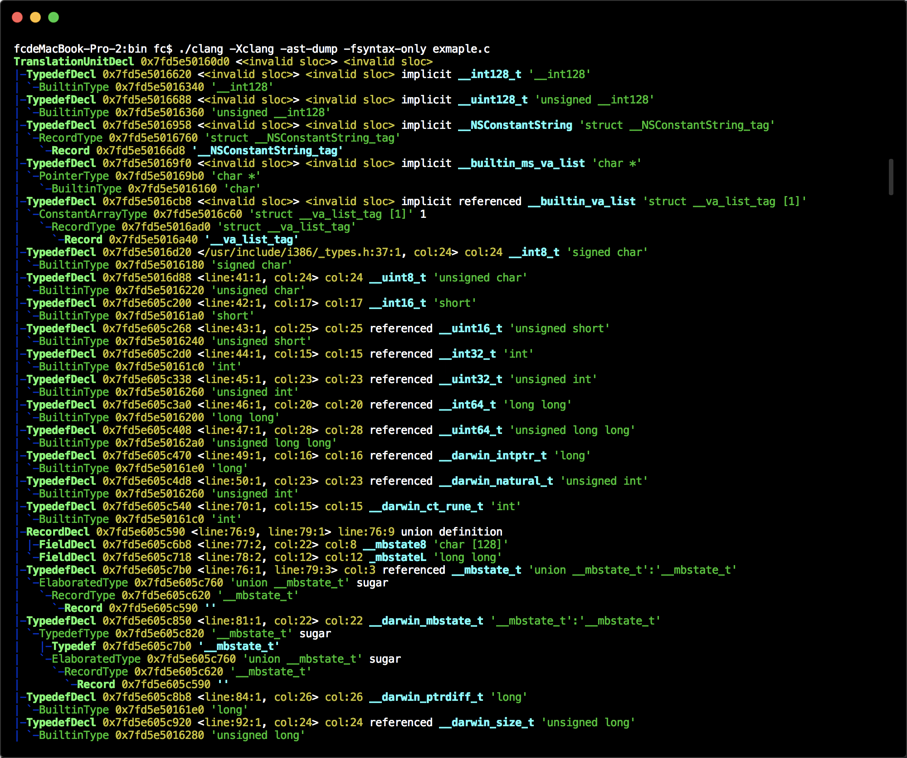

  在Python 下我们可以使用内置的AST 库来对代码构建抽象语法树

```python

import ast

node = ast.parse('a = 1')

ast.dump(node)

```

  在 `ast.dump()` 输出下可以看到JSON 格式的AST 树数据

```txt

>>> ast.dump(node)
"Module(body=[Assign(targets=[Name(id='a', ctx=Store())], value=Num(n=1))])"

```

  文本代码经过序列化之后,那么编译器接下来就可以使用抽象语法树作为数据结构来进行编译操作了.除了编译之外,做自动化白盒审计也是用到AST 来对数据流和控制流进行分析,具体细节下一章再详细分析.


### 汇编

  到了汇编阶段,Clang 和GCC 的实现会稍微有点不同之处.

  对于Clang 来说,汇编阶段是生成LLVM IR 代码,在链接时才针对目标架构进行汇编,我们使用下面这个命令来观察LLVM IR

```shell

clang -S -emit-llvm ./exmaple.c
cat ./exmaple.ll

```

  对应输出的LLVM IR 代码如下


  对于GCC 来说,汇编阶段已经生成针对目标架构生成了汇编代码,使用这个命令来观察GCC 汇编

```shell

gcc -S ./example.c
cat ./example.s

```

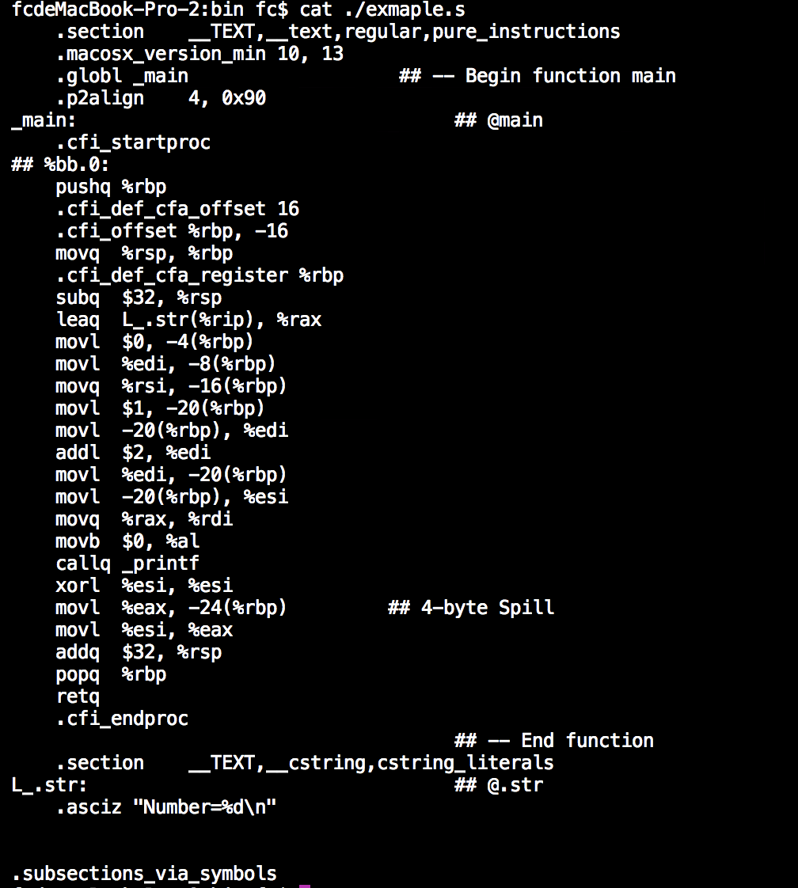

### 链接

  在最后链接输出二进制程序阶段,**ld** 把各个.o 文件和需要引用到的静态库引入打包生产二进制文件,二进制编译全过程如下图

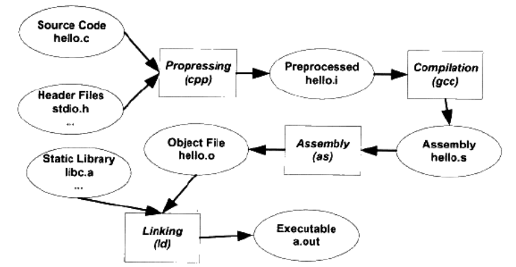

## 脚本语言运行原理

  脚本语言运行原理和二进制运行原理有很大的不同之处,后者是直接通过CPU 可以执行的二进制代码来运行,脚本则是需要依赖一个程序来解析执行.下面以微软的JavaScript 引擎ChakraCode 作为剖析,先来看看ChakraCode 架构图:


  浏览器中执行的JavaScript ,实际上是把JavaScript 代码传递给ChakraCode 来解析执行,ChakraCode 在运行时有一个上下文对象,我们根据这个对象来操作当前JavaScript 的全局对象和局部对象,也通过这个对象来区分不同的浏览器标签的JavaScript 执行空间.首先JavaScript 代码经过**Parser** 解析完成代码之后,编译成Chakra OpCode 代码流传递到**Interpreter** 中执行,也可以编译成二进制代码又**JIT** 执行.JavaScript 中的对象都由GC (**Garbage Collector** 垃圾回收器)处理,负责申请和清除对象所使用的内存空间.如果JavaScript 需要调用到一些底层的接口(比如操作socket),那这些接口的Binding 就在**Lowerer** 中实现.

### Interpreter 脚本解析器

  脚本解析器的作用是对OpCode 进行解析执行,意义为实现软件层的CPU ,执行脚本代码.这里以PHP 作为分析,代码位置(https://github.com/php/php-src/blob/623911f993f39ebbe75abe2771fc89faf6b15b9b/Zend/zend_ast.c#L449)

```c

ZEND_API int ZEND_FASTCALL zend_ast_evaluate(zval *result, zend_ast *ast, zend_class_entry *scope)
{
	zval op1, op2;
	int ret = SUCCESS;

	switch (ast->kind) {
		case ZEND_AST_BINARY_OP:  //  如果当前节点在AST 中为OpCode 类型,那就执行
			if (UNEXPECTED(zend_ast_evaluate(&op1, ast->child[0], scope) != SUCCESS)) {
				ret = FAILURE;
			} else if (UNEXPECTED(zend_ast_evaluate(&op2, ast->child[1], scope) != SUCCESS)) {
				zval_ptr_dtor_nogc(&op1);
				ret = FAILURE;
			} else {
				binary_op_type op = get_binary_op(ast->attr);  //  根据指令来获取对应的执行回调函数
				ret = op(result, &op1, &op2);  //  执行指令处理的回调函数
				zval_ptr_dtor_nogc(&op1);
				zval_ptr_dtor_nogc(&op2);
			}
			break;
            
//  省略无关代码

```

  再来看get_binary_op() 的函数代码,就是用一个大switch case 来返回回调函数指针(https://github.com/php/php-src/blob/0a6f85dbb3da5671a42c6034ab89db8ef4c6f23d/Zend/zend_opcode.c#L1017)

```c

ZEND_API binary_op_type get_binary_op(int opcode)
{
	switch (opcode) {
		case ZEND_ADD:
		case ZEND_ASSIGN_ADD:
			return (binary_op_type) add_function;
		case ZEND_SUB:
		case ZEND_ASSIGN_SUB:
			return (binary_op_type) sub_function;
		case ZEND_MUL:
		case ZEND_ASSIGN_MUL:
			return (binary_op_type) mul_function;
// ...

```

### JIT (Just-in-Time)技术

  JIT 的意义是为了加快脚本文件的执行,在编译阶段不编译成OpCode 而是编译成机器代码执行,这样就不需要用Interpreter 来解析OpCode 从而提高更多的性能.谈到JIT 在此要提到一些二进制分析工具,譬如Triton (https://github.com/JonathanSalwan/Triton),unicorn (http://www.unicorn-engine.org).这些工具是把二进制机器码抽象出来,放到专门的解析器中来执行(这样做就可以实现跨平台执行,比如说当前CPU 架构是x64 ,它可以直接x64 和x86 ,但是不可以执行ARM ,这就需要一个模拟器(emulator)来模拟ARM CPU 执行).


### Binding 原理

  Binding 的意义为底层写好的接口需要提供到上层来被调用,在解析器部分来说就是绑定内部函数对象到二进制函数代码位置.我们以electron 作为示例来讲解,先来看看渲染进程的ipcRendererInternal 的实现(https://github.com/electron/electron/blob/master/lib/renderer/ipc-renderer-internal.ts)

```typescript

const binding = process.atomBinding('ipc')
const v8Util = process.atomBinding('v8_util')

// Created by init.js.
export const ipcRendererInternal: Electron.IpcRendererInternal = v8Util.getHiddenValue(global, 'ipc-internal')
const internal = true

ipcRendererInternal.send = function (channel, ...args) {
  return binding.send(internal, channel, args)
}

ipcRendererInternal.sendSync = function (channel, ...args) {
  return binding.sendSync(internal, channel, args)[0]
}

ipcRendererInternal.sendTo = function (webContentsId, channel, ...args) {
  return binding.sendTo(internal, false, webContentsId, channel, args)
}

ipcRendererInternal.sendToAll = function (webContentsId, channel, ...args) {
  return binding.sendTo(internal, true, webContentsId, channel, args)
}

```

  可以看到,bingding 对象是由electron 封装好的ipc 接口,对应的实现代码在atom_api_rendere_ipc.cc(https://github.com/electron/electron/blob/master/atom/renderer/api/atom_api_renderer_ipc.cc)

```c++

//  省略无关代码

void Send(mate::Arguments* args,
          bool internal,
          const std::string& channel,
          const base::ListValue& arguments) {
  RenderFrame* render_frame = GetCurrentRenderFrame();
  if (render_frame == nullptr)
    return;

  bool success = render_frame->Send(new AtomFrameHostMsg_Message(
      render_frame->GetRoutingID(), internal, channel, arguments));

  if (!success)
    args->ThrowError("Unable to send AtomFrameHostMsg_Message");
}

//  省略无关代码

void Initialize(v8::Local<v8::Object> exports,
                v8::Local<v8::Value> unused,
                v8::Local<v8::Context> context,
                void* priv) {
  mate::Dictionary dict(context->GetIsolate(), exports);
  dict.SetMethod("send", &Send);  //  在指定上下文中的exports 对象中设置send 函数的底层实现
  //  省略无关代码
}

```


## Linux 下的编译过程

  对于程序的编译步骤上面已经提及了,那么我们用些示例程序来讲述各种编译工具的运行原理

### Makefile

  我们用AFL Fuzzer 作为例子,ls 列出目录文件,可以看到项目路径有一个Makefile 文件.


  编译AFL 只需要在当前目录下进行`make` 命令即可对AFL Fuzzer 进行编译.

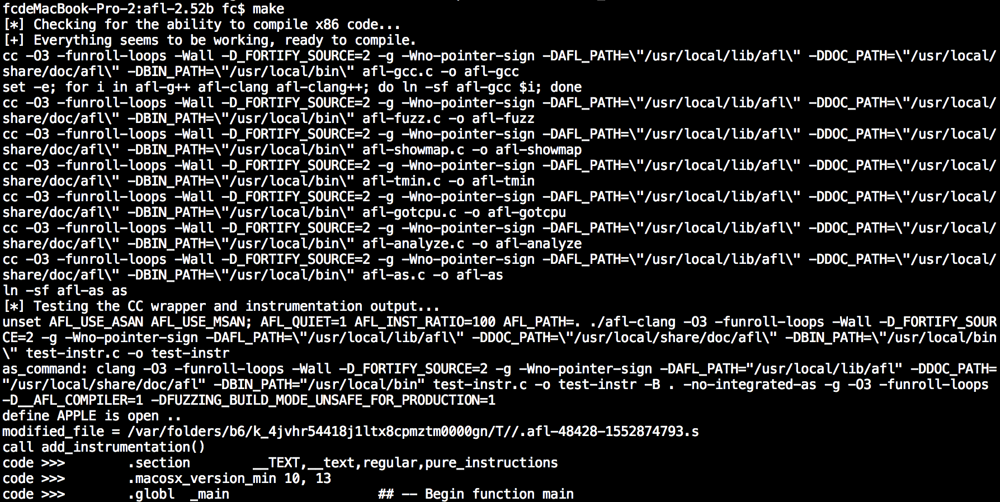

  在窗口的输出可以看到`make` 命令调用`cc` 命令执行了编译操作,把afl-xx.c 文件编译成二进制程序并执行测试操作.这些编译的命令都是已经写好保存在Makefile 文件里面的,我们用`cat` 命令来查看文件的内容.

```shell

fcdeMacBook-Pro-2:afl-2.52b fc$ cat Makefile 
#
# american fuzzy lop - makefile
# -----------------------------
#
# Written and maintained by Michal Zalewski <lcamtuf@google.com>
# 
# Copyright 2013, 2014, 2015, 2016, 2017 Google Inc. All rights reserved.
# 
# Licensed under the Apache License, Version 2.0 (the "License");
# you may not use this file except in compliance with the License.
# You may obtain a copy of the License at:
# 
#   http://www.apache.org/licenses/LICENSE-2.0
#

#  ---=== 设置环境变量 ===---
PROGNAME    = afl
VERSION     = $(shell grep '^\#define VERSION ' config.h | cut -d '"' -f2)

PREFIX     ?= /usr/local
BIN_PATH    = $(PREFIX)/bin
HELPER_PATH = $(PREFIX)/lib/afl
DOC_PATH    = $(PREFIX)/share/doc/afl
MISC_PATH   = $(PREFIX)/share/afl

# PROGS intentionally omit afl-as, which gets installed elsewhere.

PROGS       = afl-gcc afl-fuzz afl-showmap afl-tmin afl-gotcpu afl-analyze
SH_PROGS    = afl-plot afl-cmin afl-whatsup

CFLAGS     ?= -O3 -funroll-loops
CFLAGS     += -Wall -D_FORTIFY_SOURCE=2 -g -Wno-pointer-sign \
              -DAFL_PATH=\"$(HELPER_PATH)\" -DDOC_PATH=\"$(DOC_PATH)\" \
              -DBIN_PATH=\"$(BIN_PATH)\"
#  ---=== 根据当前Linux 环境进行编译调整 ===---
ifneq "$(filter Linux GNU%,$(shell uname))" ""
  LDFLAGS  += -ldl
endif

ifeq "$(findstring clang, $(shell $(CC) --version 2>/dev/null))" ""
  TEST_CC   = afl-gcc
else
  TEST_CC   = afl-clang
endif

COMM_HDR    = alloc-inl.h config.h debug.h types.h
#  ---=== make 命令选择项目 ===---
#  如果是make all ,那就调用到all: 这个地方开始,如果是make afl-gcc 就从afl-gcc 开始
#  make all 这里包含afl-gcc afl-fuzz afl-showmap afl-tmin afl-gotcpu afl-analyze (注意看PROGS 环境变量中指定了内容)afl-as
#  然后继续往下调用这些项目中指定的命令
all: test_x86 $(PROGS) afl-as test_build all_done

ifndef AFL_NO_X86

test_x86:
        @echo "[*] Checking for the ability to compile x86 code..."
        @echo 'main() { __asm__("xorb %al, %al"); }' | $(CC) -w -x c - -o .test || ( echo; echo "Oops, looks like your compiler can't generate x86 code."; echo; echo "Don't panic! You can use the LLVM or QEMU mode, but see docs/INSTALL first."; echo "(To ignore this error, set AFL_NO_X86=1 and try again.)"; echo; exit 1 )
        @rm -f .test
        @echo "[+] Everything seems to be working, ready to compile."

else

test_x86:
        @echo "[!] Note: skipping x86 compilation checks (AFL_NO_X86 set)."

endif

afl-gcc: afl-gcc.c $(COMM_HDR) | test_x86
        $(CC) $(CFLAGS) $@.c -o $@ $(LDFLAGS)
        set -e; for i in afl-g++ afl-clang afl-clang++; do ln -sf afl-gcc $$i; done

afl-as: afl-as.c afl-as.h $(COMM_HDR) | test_x86
        $(CC) $(CFLAGS) $@.c -o $@ $(LDFLAGS)
        ln -sf afl-as as

afl-fuzz: afl-fuzz.c $(COMM_HDR) | test_x86
        $(CC) $(CFLAGS) $@.c -o $@ $(LDFLAGS)

afl-showmap: afl-showmap.c $(COMM_HDR) | test_x86
        $(CC) $(CFLAGS) $@.c -o $@ $(LDFLAGS)

afl-tmin: afl-tmin.c $(COMM_HDR) | test_x86
        $(CC) $(CFLAGS) $@.c -o $@ $(LDFLAGS)

afl-analyze: afl-analyze.c $(COMM_HDR) | test_x86
        $(CC) $(CFLAGS) $@.c -o $@ $(LDFLAGS)

afl-gotcpu: afl-gotcpu.c $(COMM_HDR) | test_x86
        $(CC) $(CFLAGS) $@.c -o $@ $(LDFLAGS)

ifndef AFL_NO_X86

test_build: afl-gcc afl-as afl-showmap
        @echo "[*] Testing the CC wrapper and instrumentation output..."
        unset AFL_USE_ASAN AFL_USE_MSAN; AFL_QUIET=1 AFL_INST_RATIO=100 AFL_PATH=. ./$(TEST_CC) $(CFLAGS) test-instr.c -o test-instr $(LDFLAGS)
        echo 0 | ./afl-showmap -m none -q -o .test-instr0 ./test-instr
        echo 1 | ./afl-showmap -m none -q -o .test-instr1 ./test-instr
        @rm -f test-instr
        @cmp -s .test-instr0 .test-instr1; DR="$$?"; rm -f .test-instr0 .test-instr1; if [ "$$DR" = "0" ]; then echo; echo "Oops, the instrumentation does not seem to be behaving correctly!"; echo; echo "Please ping <lcamtuf@google.com> to troubleshoot the issue."; echo; exit 1; fi
        @echo "[+] All right, the instrumentation seems to be working!"

else

test_build: afl-gcc afl-as afl-showmap
        @echo "[!] Note: skipping build tests (you may need to use LLVM or QEMU mode)."

endif

all_done: test_build
        @if [ ! "`which clang 2>/dev/null`" = "" ]; then echo "[+] LLVM users: see llvm_mode/README.llvm for a faster alternative to afl-gcc."; fi
        @echo "[+] All done! Be sure to review README - it's pretty short and useful."
        @if [ "`uname`" = "Darwin" ]; then printf "\nWARNING: Fuzzing on MacOS X is slow because of the unusually high overhead of\nfork() on this OS. Consider using Linux or *BSD. You can also use VirtualBox\n(virtualbox.org) to put AFL inside a Linux or *BSD VM.\n\n"; fi
        @! tty <&1 >/dev/null || printf "\033[0;30mNOTE: If you can read this, your terminal probably uses white background.\nThis will make the UI hard to read. See docs/status_screen.txt for advice.\033[0m\n" 2>/dev/null

.NOTPARALLEL: clean

clean:
        rm -f $(PROGS) afl-as as afl-g++ afl-clang afl-clang++ *.o *~ a.out core core.[1-9][0-9]* *.stackdump test .test test-instr .test-instr0 .test-instr1 qemu_mode/qemu-2.10.0.tar.bz2 afl-qemu-trace
        rm -rf out_dir qemu_mode/qemu-2.10.0
        $(MAKE) -C llvm_mode clean
        $(MAKE) -C libdislocator clean
        $(MAKE) -C libtokencap clean

install: all
        mkdir -p -m 755 $${DESTDIR}$(BIN_PATH) $${DESTDIR}$(HELPER_PATH) $${DESTDIR}$(DOC_PATH) $${DESTDIR}$(MISC_PATH)
        rm -f $${DESTDIR}$(BIN_PATH)/afl-plot.sh
        install -m 755 $(PROGS) $(SH_PROGS) $${DESTDIR}$(BIN_PATH)
        rm -f $${DESTDIR}$(BIN_PATH)/afl-as
        if [ -f afl-qemu-trace ]; then install -m 755 afl-qemu-trace $${DESTDIR}$(BIN_PATH); fi
ifndef AFL_TRACE_PC
        if [ -f afl-clang-fast -a -f afl-llvm-pass.so -a -f afl-llvm-rt.o ]; then set -e; install -m 755 afl-clang-fast $${DESTDIR}$(BIN_PATH); ln -sf afl-clang-fast $${DESTDIR}$(BIN_PATH)/afl-clang-fast++; install -m 755 afl-llvm-pass.so afl-llvm-rt.o $${DESTDIR}$(HELPER_PATH); fi
else
        if [ -f afl-clang-fast -a -f afl-llvm-rt.o ]; then set -e; install -m 755 afl-clang-fast $${DESTDIR}$(BIN_PATH); ln -sf afl-clang-fast $${DESTDIR}$(BIN_PATH)/afl-clang-fast++; install -m 755 afl-llvm-rt.o $${DESTDIR}$(HELPER_PATH); fi
endif
        if [ -f afl-llvm-rt-32.o ]; then set -e; install -m 755 afl-llvm-rt-32.o $${DESTDIR}$(HELPER_PATH); fi
        if [ -f afl-llvm-rt-64.o ]; then set -e; install -m 755 afl-llvm-rt-64.o $${DESTDIR}$(HELPER_PATH); fi
        set -e; for i in afl-g++ afl-clang afl-clang++; do ln -sf afl-gcc $${DESTDIR}$(BIN_PATH)/$$i; done
        install -m 755 afl-as $${DESTDIR}$(HELPER_PATH)
        ln -sf afl-as $${DESTDIR}$(HELPER_PATH)/as
        install -m 644 docs/README docs/ChangeLog docs/*.txt $${DESTDIR}$(DOC_PATH)
        cp -r testcases/ $${DESTDIR}$(MISC_PATH)
        cp -r dictionaries/ $${DESTDIR}$(MISC_PATH)

publish: clean
        test "`basename $$PWD`" = "afl" || exit 1
        test -f ~/www/afl/releases/$(PROGNAME)-$(VERSION).tgz; if [ "$$?" = "0" ]; then echo; echo "Change program version in config.h, mmkay?"; echo; exit 1; fi
        cd ..; rm -rf $(PROGNAME)-$(VERSION); cp -pr $(PROGNAME) $(PROGNAME)-$(VERSION); \
          tar -cvz -f ~/www/afl/releases/$(PROGNAME)-$(VERSION).tgz $(PROGNAME)-$(VERSION)
        chmod 644 ~/www/afl/releases/$(PROGNAME)-$(VERSION).tgz
        ( cd ~/www/afl/releases/; ln -s -f $(PROGNAME)-$(VERSION).tgz $(PROGNAME)-latest.tgz )
        cat docs/README >~/www/afl/README.txt
        cat docs/status_screen.txt >~/www/afl/status_screen.txt
        cat docs/historical_notes.txt >~/www/afl/historical_notes.txt
        cat docs/technical_details.txt >~/www/afl/technical_details.txt
        cat docs/ChangeLog >~/www/afl/ChangeLog.txt
        cat docs/QuickStartGuide.txt >~/www/afl/QuickStartGuide.txt
        echo -n "$(VERSION)" >~/www/afl/version.txt
fcdeMacBook-Pro-2:afl-2.52b fc$ 

```

  项目的编译过程和细节用Makefile 写好,`make` 命令的用意是提供自动处理并执行Makefile 中的编译指令来生成程序代码.


### 针对平台生成Makefile  

  Linux 系统衍生出了各种不同的版本,比如说Centos Ubuntu Android ,这些版本中可能会修改了内核和系统库的一些相关的数据结构或者运行环境.所以项目代码需要对这些各种不一样的Linux 系统进行预处理(查找系统库路径并引入,检查第三方依赖库版本等)然后生成Makefile .常用的方法有两种:


#### cmake

  判断一个项目中是否使用cmake ,我们看这个目录下是不是有CMakeLists.txt 文件,以evmjit (https://github.com/ethereum/evmjit)为例子:


  我们进入项目代码目录来查看,每个代码目录都会存在CMakeLists.txt 文件.


  回到项目根目录的CMakeLists.txt 文件来查看文件内容,分析如下:

```cmake

fcdeMacBook-Pro-2:evmjit fc$ cat CMakeLists.txt 
cmake_minimum_required(VERSION 3.4.0)  #  指定CMake 最低版本

cmake_policy(SET CMP0042 OLD)   # Fix MACOSX_RPATH.
cmake_policy(SET CMP0048 NEW)   # Allow VERSION argument in project().
if (POLICY CMP0054)
        cmake_policy(SET CMP0054 NEW)   # No longer implicitly dereference variables.
endif()

set(CMAKE_CONFIGURATION_TYPES Debug Release RelWithDebInfo)

project(EVMJIT VERSION 0.9.0.2 LANGUAGES CXX C)

list(APPEND CMAKE_MODULE_PATH "${CMAKE_CURRENT_LIST_DIR}/cmake")

message(STATUS "EVM JIT ${EVMJIT_VERSION_MAJOR}.${EVMJIT_VERSION_MINOR}.${EVMJIT_VERSION_PATCH}")

if (NOT ${CMAKE_SYSTEM_PROCESSOR} MATCHES "x86_64|AMD64")  #  判断当前平台的CPU 架构是不是intel/AMD 64 位
        message(FATAL_ERROR "Target ${CMAKE_SYSTEM_PROCESSOR} not supported -- EVM JIT works only on x86_64 architecture")
endif()

option(EVMJIT_EXAMPLES "Generate build targets for the EVMJIT examples" OFF)  #  自定义CMake 编译选项
option(EVMJIT_TESTS "Create targets for CTest" OFF)

set_property(GLOBAL PROPERTY USE_FOLDERS ON)

if (CMAKE_CXX_COMPILER_ID STREQUAL "MSVC")  #  Windows 平台编译需要引入的编译参数
        # Always use Release variant of C++ runtime.
        # We don't want to provide Debug variants of all dependencies. Some default
        # flags set by CMake must be tweaked.
        string(REPLACE "/MDd" "/MD" CMAKE_CXX_FLAGS_DEBUG ${CMAKE_CXX_FLAGS_DEBUG})
        string(REPLACE "/D_DEBUG" "" CMAKE_CXX_FLAGS_DEBUG ${CMAKE_CXX_FLAGS_DEBUG})
        string(REPLACE "/RTC1" "" CMAKE_CXX_FLAGS_DEBUG ${CMAKE_CXX_FLAGS_DEBUG})
        set_property(GLOBAL PROPERTY DEBUG_CONFIGURATIONS OFF)
else()                                      #  Linux / macOS 编译需要引入的编译参数
        set(CMAKE_CXX_FLAGS "-std=c++11 -Wall -Wextra -Wconversion -Wno-sign-conversion -Wno-unknown-pragmas ${CMAKE_CXX_FLAGS}")
endif()

if (CMAKE_SYSTEM_NAME STREQUAL "Linux" AND NOT SANITIZE)
        # Do not allow unresolved symbols in shared library (default on linux)
        # unless sanitizer is used (sanity checks produce unresolved function calls)
        set(CMAKE_SHARED_LINKER_FLAGS "-Wl,--no-undefined")
endif()

include(ProjectLLVM)
configure_llvm_project()

add_subdirectory(evmc)  #  添加代码目录

add_subdirectory(libevmjit)  #  添加代码目录

if (EVMJIT_TESTS)
        enable_testing()
        add_subdirectory(tests)
endif()

```

  我们再来看看`libevmjit` 目录下的CMakeLists.txt 文件内容,这里指明的是如何对各个文件进行编译命令生成和引入依赖文件代码:

```cmake

fcdeMacBook-Pro-2:libevmjit fc$ cat CMakeLists.txt 
get_filename_component(EVMJIT_INCLUDE_DIR ../include ABSOLUTE)

set(SOURCES     #  添加编译文件
        JIT.cpp                         JIT.h
        Arith256.cpp            Arith256.h
        Array.cpp                       Array.h
        BasicBlock.cpp          BasicBlock.h
        Cache.cpp                       Cache.h
                                                Common.h
        Compiler.cpp            Compiler.h
        CompilerHelper.cpp      CompilerHelper.h
        Endianness.cpp          Endianness.h
        ExecStats.cpp           ExecStats.h
        Ext.cpp                         Ext.h
        GasMeter.cpp            GasMeter.h
        Instruction.cpp         Instruction.h
        Memory.cpp                      Memory.h
        Optimizer.cpp           Optimizer.h
        RuntimeManager.cpp      RuntimeManager.h
        Type.cpp                        Type.h
        Utils.cpp                       Utils.h
)
source_group("" FILES ${SOURCES})

if(CMAKE_CXX_COMPILER_ID STREQUAL "MSVC")  #  判断Windows 平台
else()
        set(CMAKE_CXX_FLAGS "${CMAKE_CXX_FLAGS} -fno-rtti -fvisibility=hidden")
        if(CMAKE_SYSTEM_NAME STREQUAL "Linux")
                set(CMAKE_SHARED_LINKER_FLAGS "${CMAKE_SHARED_LINKER_FLAGS} -Wl,--exclude-libs,ALL") # Do not export symbols from dependies, mostly LLVM libs
        endif()
endif()


string(COMPARE EQUAL "${LLVM_ENABLE_ASSERTIONS}" "ON" LLVM_DEBUG)
configure_file(BuildInfo.h.in ${CMAKE_CURRENT_BINARY_DIR}/gen/BuildInfo.gen.h)

add_library(evmjit ${SOURCES} gen/BuildInfo.gen.h)
# Explicit dependency on llvm to download LLVM header files.
add_dependencies(evmjit LLVM::JIT)  #  添加依赖文件
get_target_property(LLVM_COMPILE_DEFINITIONS LLVM::JIT INTERFACE_COMPILE_DEFINITIONS)
if (LLVM_COMPILE_DEFINITIONS)
        target_compile_definitions(evmjit PRIVATE ${LLVM_COMPILE_DEFINITIONS})
endif()
get_target_property(LLVM_INCLUDE_DIRECTORIES LLVM::JIT INTERFACE_INCLUDE_DIRECTORIES)
target_include_directories(evmjit SYSTEM PRIVATE ${LLVM_INCLUDE_DIRECTORIES})  #  添加头文件目录
target_include_directories(evmjit PRIVATE ${CMAKE_CURRENT_BINARY_DIR}/gen)
target_include_directories(evmjit PUBLIC ${EVMJIT_INCLUDE_DIR})

include(GNUInstallDirs)
install(TARGETS evmjit
                RUNTIME DESTINATION ${CMAKE_INSTALL_BINDIR}
                LIBRARY DESTINATION ${CMAKE_INSTALL_LIBDIR}
                ARCHIVE DESTINATION ${CMAKE_INSTALL_LIBDIR})
install(DIRECTORY ${EVMJIT_INCLUDE_DIR}/
                DESTINATION ${CMAKE_INSTALL_INCLUDEDIR})


# When building static lib add additional target evmjit-standalone --
# an archive containing all LLVM dependencies in a single file.
get_target_property(_evmjit_type evmjit TYPE)
if (_evmjit_type STREQUAL STATIC_LIBRARY)
        get_link_libraries(EVMJIT_LINK_LIBRARIES evmjit)
        set(EVMJIT_STANDALONE_FILE ${CMAKE_STATIC_LIBRARY_PREFIX}evmjit-standalone${CMAKE_STATIC_LIBRARY_SUFFIX})
        if (MSVC)
          #  ...
        elseif (APPLE)
                add_custom_command(OUTPUT ${EVMJIT_STANDALONE_FILE}  #  组装编译命令
                                                   COMMAND libtool -static -o ${EVMJIT_STANDALONE_FILE} $<TARGET_FILE:evmjit> ${EVMJIT_LINK_LIBRARIES}
                                                   VERBATIM)
                add_custom_target(evmjit-standalone DEPENDS ${EVMJIT_STANDALONE_FILE})
                install(FILES ${CMAKE_CURRENT_BINARY_DIR}/${EVMJIT_STANDALONE_FILE} DESTINATION ${CMAKE_INSTALL_LIBDIR} OPTIONAL)
        elseif (CMAKE_AR)
          #  ...
        endif()
endif()

```

  CMake 的原理是,通过项目根目录的CMakeLists.txt 包含各子目录的CMakeLists.txt ,引入各种依赖目录和各平台的编译参数,最后生成一个Makefile .我们在项目的根目录使用`cmake .` 让cmake 对CMakeLists.txt 进行Makefile 生成.结果如下:

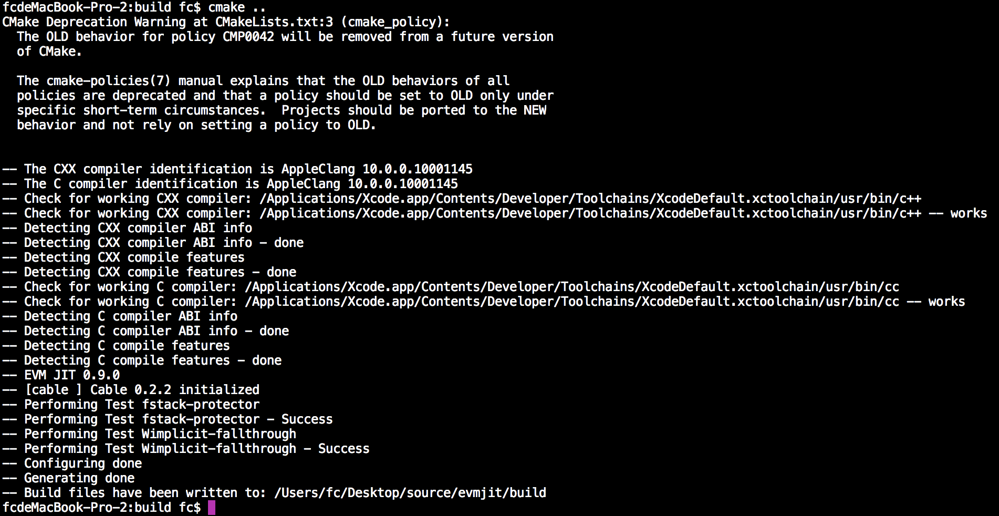

  `cmake .` 的意思是,`.` 是指从当前目录的CMakeLists.txt 开始进行遍历,并生成数据对应的Makefile ,CMakeFiles 和CMakeCache.txt 到当前目录.使用了`cmake .` 来生成编译文件的话,那么各个子目录中也会生成出CMakeFiles 和CMakeCache.txt ,如果以后要发布代码或者添加新的依赖库和编译指令,那还需要对各个目录的CMakeFiles 和CMakeCache.txt 进行文件删除.所以正确的使用方式是先在项目根目录下`mkdir build` 创建新的build 目录,然后`cd build` 进入目录,接下来`cmake ..` 进行编译文件生成.


  然后执行`make` 命令就可以利用cmake 生成的编译文件进行编译了,结果如下:

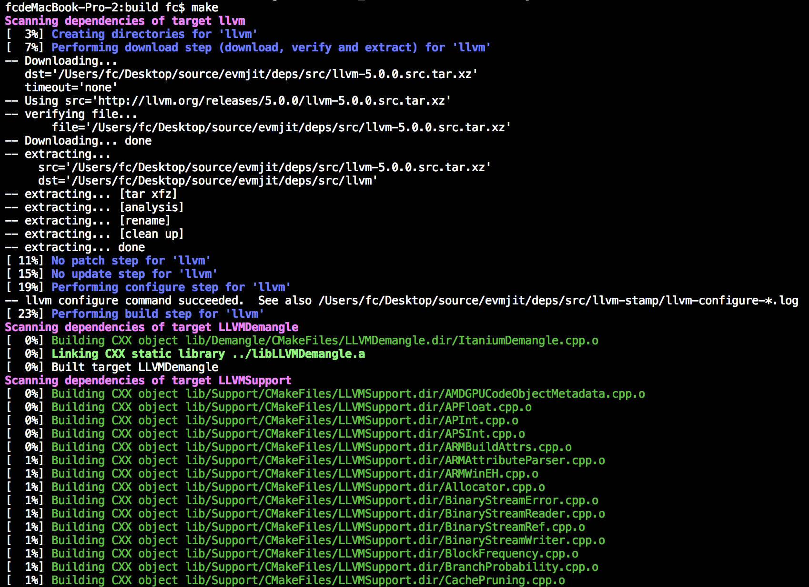

  make 程序默认是使用单线程对项目进行编译,但是对于这种要编译很多文件的项目来说这样就太慢了.make 命令有一个-j 参数,它的意义在于启用多个线程进行编译,`make -j8` 就是启用8 个线程.因为我的机器比较牛逼,所以用`make -j12` 启用12 个线程来跑.

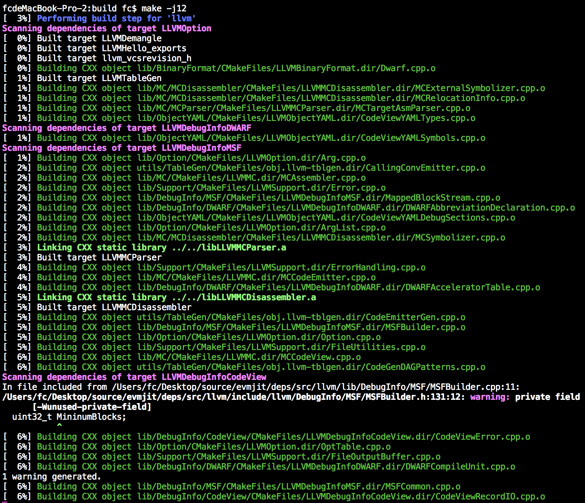

  提示,如果需要在编译过程中修改不同的编译参数时,把CMakeFiles 和CMakeCache.txt 文件都要删除重新进行cmake 操作.这个时候用build 目录存放CMake 生成文件的方便之处就体现出来了,只需要把build 目录删除重新创建即可,如果直接在根目录下cmake . 的话,各个代码目录都有CMakeFiles 和CMakeCache.txt ,假若删除的操作不当,可能会把项目代码文件给误删(如果是用命令rm -rf CMake* ,那么就会误删CMakeLists.txt ).


#### configure

  判断一个项目中是否使用configure ,我们看这个目录下是不是有configure 文件,php-src (https://github.com/php/php-src)为例子:


  使用configure 很简单,直接在目录下执行`./configure` 即可生成Makefile 文件


### 编译参数引入

  我们在希望在编译的过程中引入一些编译的参数,可以在两个地方引入.生成Makefile 阶段和make 阶段


#### 生成Makefile 阶段

  在使用./configure 生成Makefile 的时候,可以在./configure 的后面添加入编译器的参数,如果要使用指定的编译器来编译,我们可以这么来写:

```shell

./configure CC=clang CXX=clang++

```

  其中,`CC=clang` 是指选择clang 作为C 编译器,`CXX=clang++` 作为C++ 编译器.如果希望使用afl 来跑Fuzzing 程序的话,第一步就需要在./configure 阶段指定编译器为afl 编译器,不使用afl 作为编译器的话,那么就无法对程序进行代码插桩(afl-fuzz 只是一个server ,传递和生成数据给被fuzzing 程序执行,被fuzzing 的程序在编译阶段就已经由afl-clang afl-gcc 这些编译器进行插桩代码).

```shell

./configure CC=afl-clang CXX=afl-clang++

```

  选择好编译器之后,我们希望编译时启用ASAN ,那么就需要在CFLAGS CXXFLAGS 中指定参数,启用ASAN 的参数是`-fsanitize=address` ,构造的编译生成命令如下:

```shell

./configure CC=clang CXX=clang++ CFLAGS="-fsanitize=address" CXXFLAGS="-fsanitize=address"

```

  如果希望在此基础上引入三级代码优化和带GCC 版本函数符号编译,那么可以这样写

```shell

./configure CC=clang CXX=clang++ CFLAGS="-fsanitize=address -O3 -g" CXXFLAGS="-fsanitize=address -O3 -g"

```

  读者会注意到,为什么要同时指定C 和C++ 版本的编译器和编译参数呢?因为有些项目会同时存在C 和C++ 代码,所以我们在此需要同时指定一样的编译器和编译参数,以免在make 阶段因为两个版本的编译器的编译结果不符合导致链接时发生异常.

  除此之外,有时候还需要指定引入依赖库的名字和地址,我们需要在LDFLAGS 中指定(这些库必须是由lib 字符做前缀的,然后在引入的时候需要-lxxx 导入库名字,小心注意这个坑)

```shell

./configure CC=clang CXX=clang++ LDFLAGS="-lm -lz"

```

  如果要指定包含文件的目录和库目录,那么就这样写(-I 是指定头文件目录,-L 是指定库文件目录)

```shell

./configure CC=clang CXX=clang++ CFLAGS="-I /usr/local/xxx -L /usr/local/xxx "

```

  对于CMake 来说,就不能使用像./configure 这样的方式来填写编译参数了.注意我们需要在参数前面添加-D 前缀,cmake 的自定义参数和./configure 稍有不同,举个例子

```shell

cmake .. -DCMAKE_C_COMPILER=clang -DCMAKE_CXX_COMPILER=clang++ -DCMAKE_C_FLAGS="-fsanitize=address" -DCMAKE_CXX_FLAGS="-fsanitize=address"

```

  有时候在cmake 用参数设置编译器会失效,那就需要手工在CMakeLists.txt 中指定编译器,代码如下:

```cmake

set(CMAKE_C_COMPILER "/usr/local/gcc")
set(CMAKE_CXX_COMPILER "/usr/local/g++")

```

#### make 阶段

  在make 引入数据的方式和./configure 是一样的

```shell

make CC=clang CXX=clang++ LDFLAGS="-lm -lz"

```

  但是在make 阶段中和./configure ,cmake 不同之处是还会根据环境变量来获取一些相关的数据来指定编译过程.以AFL 作为例子,我们知道,在编译过程中是不能直接指定CC=afl-clang 然后CFLAGS=-fsanitize=address 来引入ASAN 的,此时AFL 会报错提示,正确的操作方式是先在./configure 阶段指定好afl-clang ,然后在make 阶段这么操作

```shell

AFL_USE_ASAN=1 make

```

  此时环境变量AFL_USE_ASAN 的值就会设置为1 ,AFL 根据这个值来自行构造编译命令给clang/gcc 来执行编译.所以,有些参数是需要在命令中传递的,有一些则是通过环境变量传递的,具体问题具体分析.


### 缺少系统依赖库

  在编译项目的过程中,可能会遇到缺少依赖库(这些库可能是头文件或者库文件).所以就需要我们来手工引入这些文件,以编译EOS 为例子.

  笔者在cmake 时因为libboost 库版本过低,所以需要重新安装.

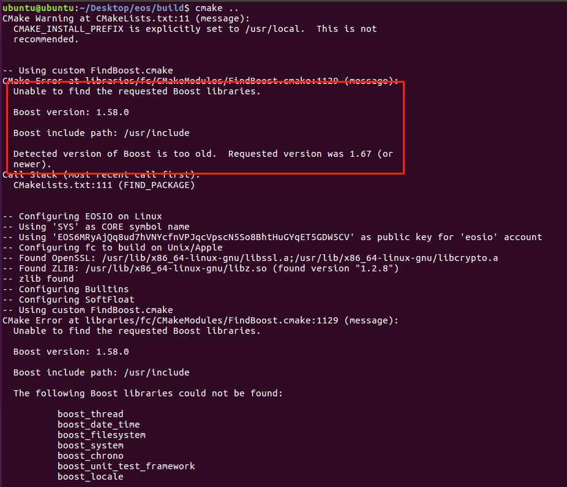

  到boost 官网下载1.69.0 代码库到本地,直接用wget 命令就可以保存文件到当前目录.

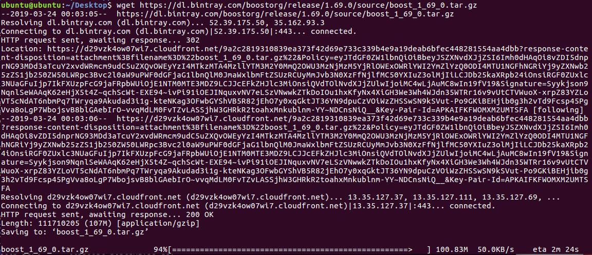

  下载成功之后,使用`tar -xvf boost_1_69_0.tar.gz` 即可解压到当前目录.然后进入目录开始编译:


  boost 库的编译步骤和之前的方式有些不同,它是自己构造好了一个脚本让用户调用部署,cd 到这个目录可以看到`bootstrap.sh` 脚本,直接运行即可.

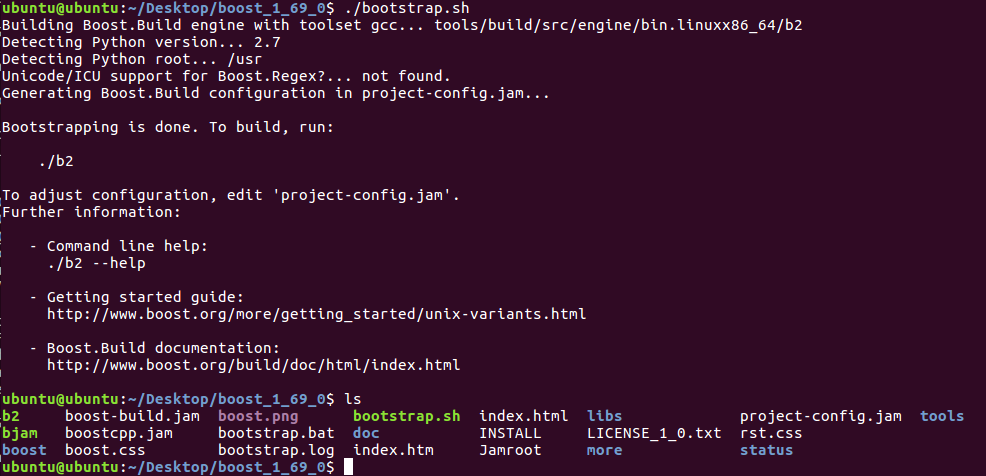

  `bootstrap.sh` 脚本提示我们执行`./b2` 脚本,于是继续执行`./b2` 脚本,boost 库就能够自动编译了.


  等待编译完成.


  接下来,我们使用`sudo ./b2 install` 来安装boost 库.

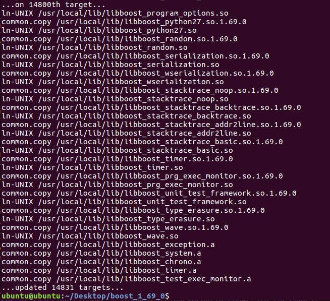

  现在cmake .. 可以找到一些boost 库,但是boost 库版本版本还是没有被识别到.

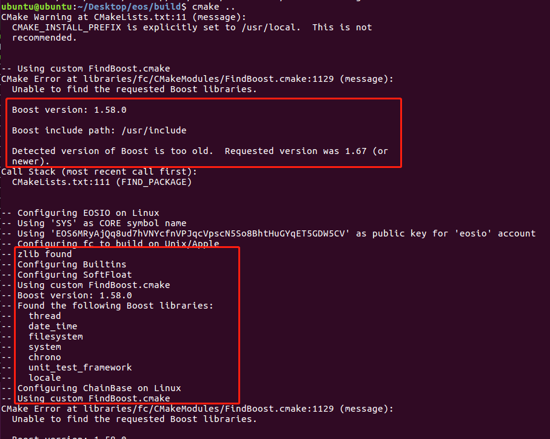

  注意cmake 的提示,它是在`/usr/include` 目录中寻找boost 库的,于是先来`ls /usr/include` 查看一下头文件.


  我们回过头来看看`sudo ./b2 install` 到底安装到了哪个位置,可以发现编译之后的头文件安装到了`/usr/local/include` 目录.

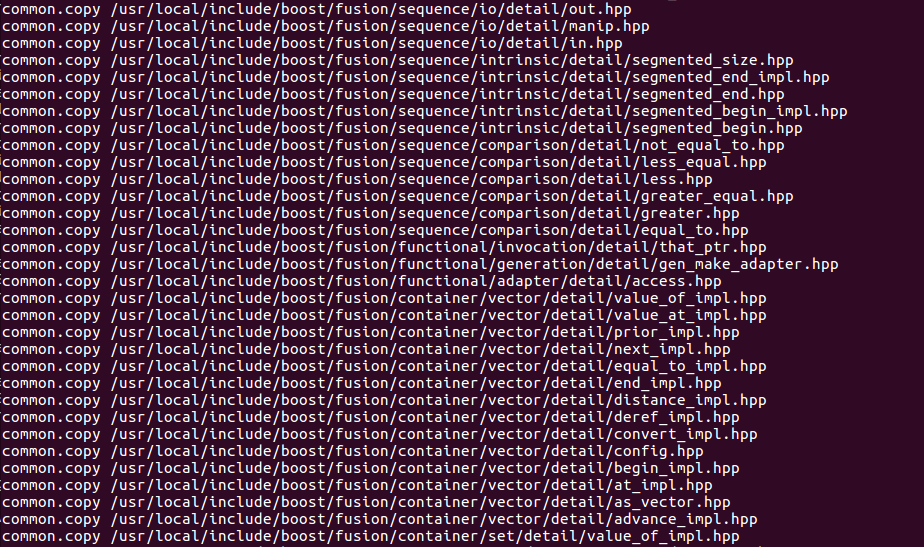

  然后我们来操作一波`rm -rf + cp`,把`/usr/local/include` 中的新编译的内容移动到`/usr/include` 中.


  重新cmake 项目,发现cmake 输出了我们安装的新版boost 库的版本.


  往下发现,cmake 发现系统缺少了libusb-1.0 和libcurl 库,所以需要安装它,因为当前的环境是ubuntu ,于是使用`apt install` 就能很方便地安装;如果在mac 下,那就需要用`brew install` ,注意brew 安装的库还需要自己手工调节环境变量PATH ,让安装好的库程序能够被找到.

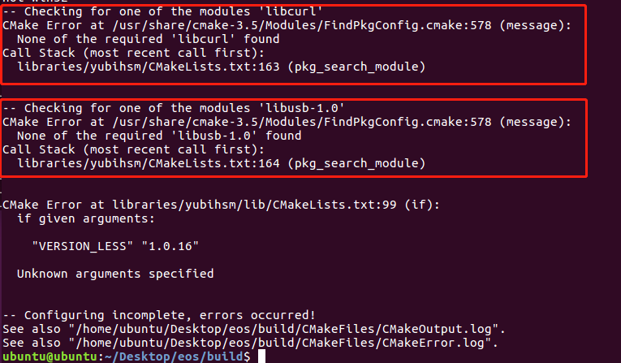

  在命令窗口中输入`sudo apt install libusb` 加`TAB` 键,apt 命令就会列举出来很多和libusb 相关的程序.


  如果是编译过程中缺少了库,需要我们去安装的话,建议安装xxx-dbg 版的库程序.因为本次cmake .. 缺少的版本是libusb-1.0 库,所以需要用apt 安装libusb-1.0-dev 库.输入`sudo apt install libusb-1.0-0-dev` 下载libusb 库.

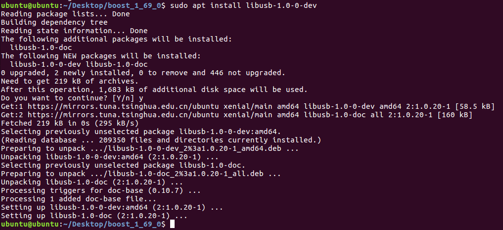

  重新cmake 项目,此时cmake 可以识别到libusb-1.0 库了.

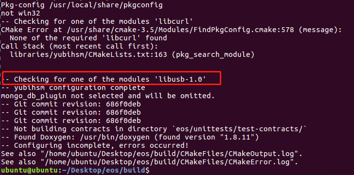

  接下来使用同样的方法来安装libcurl 库.


  发现cmake 并没有成功识别,然后我们继续看看apt 有哪些库程序可以下载.


  我们注意这个`libcurl4-openssl-dev` .


  因为eos 是依赖openssl 的,猜测是不是需要curl 也引入openssl ,继续安装这个库.


  重新cmake 项目,此时cmake 可以识别到libcurl 库了并生成Makefile 了.接下来就是一边编译一边摸鱼的快乐时光了,哈哈哈..

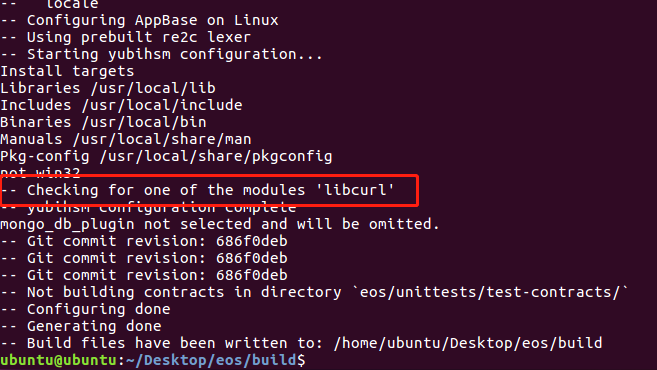


### 总结

  本章前本段的编译知识着重于介绍一些编译相关知识,了解这些知识在后面中编写更强力的Fuzzer 中会使用到.后半段着重于实战环境中的Linux 下的编译过程,这里提到的一些编译参数的设置方法在使用第三方编译工具时经常会遇到知识,避坑的方法大概是:引入库文件,头文件/强制修改编译器等等,具体问题按场景具体分析.
