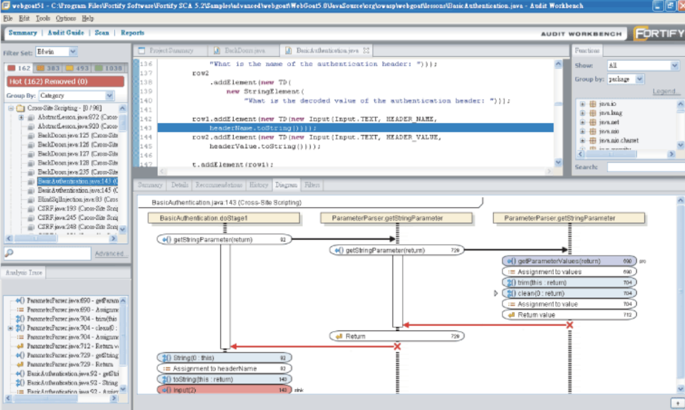
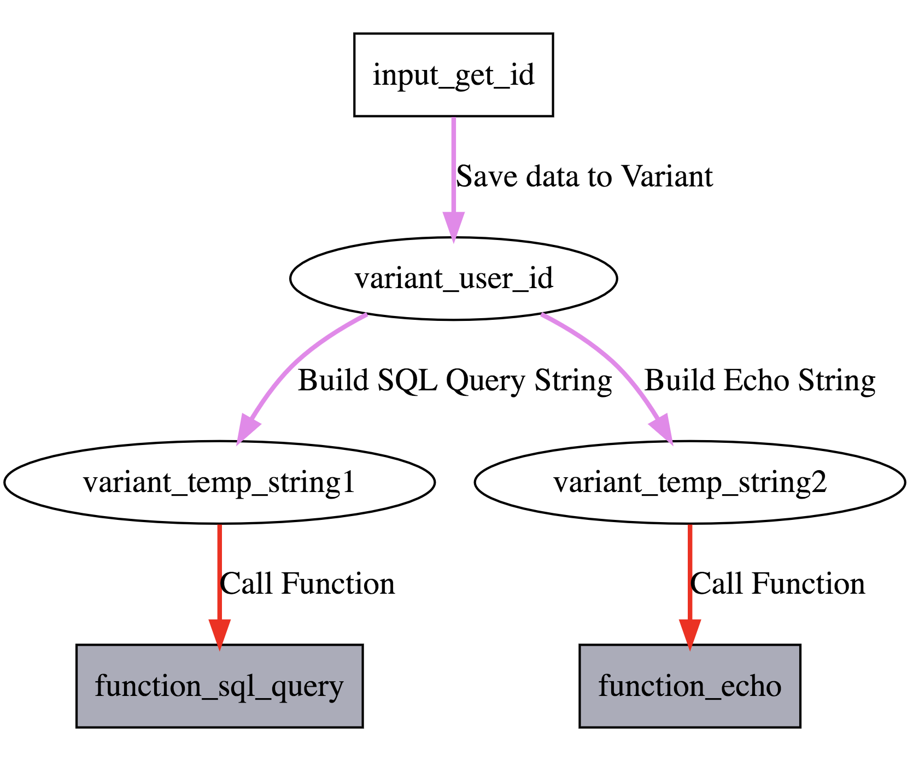
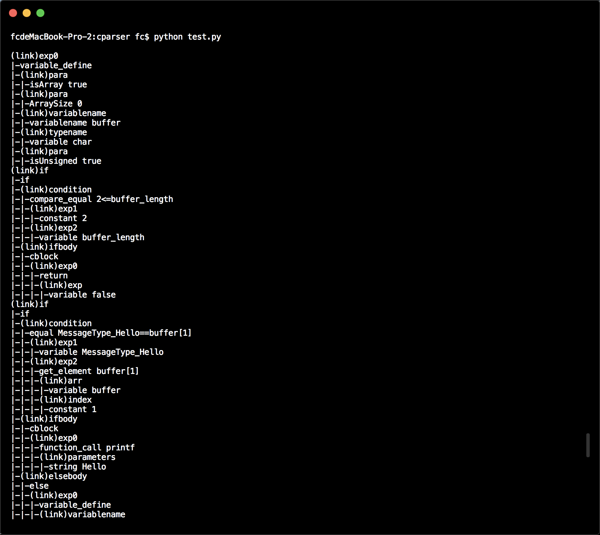
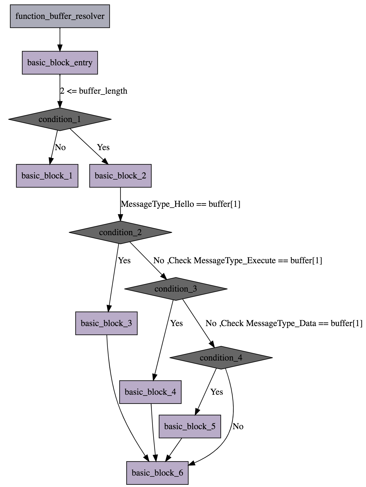

## 必备工具

  clang ,Python 

## 静态代码分析基本原理

  静态代码分析是基于有源码的情况下根据已有的规则来匹配源码中是否可能存在漏洞.对于漏洞规则,我们一般分为两种情况:二进制语言和脚本解析语言.为什么要这么样来区分呢?这是因为脚本解析语言绝大部分的漏洞是没有过滤用户的输入,使得用户的输入传递到了敏感函数中执行(比如SQL 注入,反序列化,远程命令执行的原理等),有少部分的漏洞是因为语言本身的特性而导致的.但是二进制语言(C/C++/go)除了前面所述的逻辑,最难的一点是计算程序内存区域是否会出现异常情况(也就是二进制漏洞中常见的UaF ,OOB 等),用静态代码分析比较难发现这些隐藏的漏洞.所以我们先从简单的来说起,相信做过PHP 白盒审计的读者们都知道Seay源码审计助手,这个工具的原理就是通过正则表达式在代码文本中匹配相应的规则,然后生成漏洞报告.


  Seay源码审计助手只定位到代码调用敏感函数的位置,但是并没有对参数进行相应的校验,比如说对代码`include  $Dir . "/test.php";` 的检测,假设`$Dir = "/var/www/";` ,审计助手也是依旧识别为可能存在文件包含漏洞,其实`$Dir` 的值是固定的,只需要跟踪这个值就可以知道它是不可控的变量.

  我们再来看一下fortity SCA ,fortify 对项目扫描除了匹配漏洞之外,还会根据程序的逻辑和函数交叉引用来绘制程序时序图表.接下来我们来了解一些静态代码分析的基本原理.



### 数据流跟踪

  我们先来一段示例代码:

```c

#include <malloc.h>
#include <memory.h>
#include <stdlib.h>
#include <stdio.h>


enum {
  MessageType_Hello = 0,
  MessageType_Execute,
  MessageType_Data
};

void execute_command(const unsigned char* command) {
    system(command);
}

void decrypt_data(const unsigned char* data_buffer,unsigned char data_buffer_length) {
    unsigned char* buffer[8] = {0};
    
    for (unsigned int data_index = 0;data_index < data_buffer_length;++data_index)
        buffer[data_index] = data_buffer[data_index] ^ 0x65;
    
    printf("Recv:%s\n",&buffer);
}

int buffer_resolver(const unsigned char* buffer) {
    unsigned char buffer_length = buffer[0];
    
    if (2 <= buffer_length)
        return 0;
    
    if (MessageType_Hello == buffer[1]) {
        printf("Hello\n");
    } else if (MessageType_Execute == buffer[1]) {
        unsigned char* command_buffer = (unsigned char*)malloc(buffer_length - 1);
        
        memset(&command_buffer,0,buffer_length);
        memcpy(&command_buffer,&buffer[2],buffer_length - 2);
        
        execute_command(command_buffer);
    } else if (MessageType_Data == buffer[1]) {
        decrypt_data(&buffer[2],buffer_length - 2);
    }
    
    return 1;
}

```

  这是一段简单的解析数据包的示例代码,可以看到入口点`buffer_resolver()` 函数提供了一个buffer 参数供外部调用,接下来程序逻辑就针对这个buffer 的内容进行解析然后做进一步的处理.数据流跟踪的意义在于,对一个特定的变量或者参数进行数据流分析,找到这个变量或者参数的来源是否为可控的.

  我们把`buffer_resolver()` 的代码抽象成数据流图.


  现在我们可以很清楚地了解到`buffer_resolver()` 中的数据流过程.图表中绿色代表函数的参数输入,紫色线代表读数据,蓝色线代表写数据,红色线是传递该内容到函数中调用,在标注线的内容中也提到了如何操作数据和操作的位置.在我们做白盒分析代码的时候,一般是定位到敏感函数的位置再做数据流分析.上面的数据流图是**从上往下**分析的,但是如果要对敏感函数的参数进行溯源分析,此时就是要构画一个**从下往上**的数据流图分析.我们的规则匹配到`execute_command()` ,然后从第一个参数开始往上跟踪,可以得到图表如下:


  有了这张粗略的从数据流回溯图,我们很容易就能看到`execute_command()` 的参数受到哪些地方影响.所以,**当我们定位到某个规则的时候,需要找到能够影响参数的内容,就需要从下往上(从敏感参数开始向上搜索)来对数据流进行回溯;当我们从数据输入位置开始搜索它能影响到哪些变量和参数,就需要从上往下(从可控输入开始向下搜索)对数据进行跟踪**.再举个简单的PHP 例子:

```php

<?php
    
    $user_id = $_GET['id'];

    $user_name = sql_query('SELECT user_name FROM user WHERE uid = ' . $user_id);

    echo 'Hello : ' . $user_name . ' Uid(' . $user_id . ')';
    
?>

```

  对$_GET['id'] 进行数据跟踪,可以发现两个漏洞问题:SQL 注入和XSS .



  对`sql_query()` 进行漏洞规则,我们可以看到在拼接字符串阶段直接把`$user_id` 引入到`sql_query()` 的参数中.


  对echo 的搜索方式也是一样的原理,限于篇幅此处省略.

  下面使用Python 来对示例C++ 代码实现分析.用到https://github.com/tscosine/cparser/ 来解析C++ 代码成AST 代码树

```python

import cparser

code = '''
int buffer_resolver(const unsigned char* buffer) {
    unsigned char buffer_length = buffer[0];
    
    if (2 <= buffer_length)
        return 0;
    
    if (MessageType_Hello == buffer[1]) {
        printf("Hello\n");
    } else if (MessageType_Execute == buffer[1]) {
        unsigned char* command_buffer = (unsigned char*)malloc(buffer_length - 1);
        
        memset(&command_buffer,0,buffer_length);
        memcpy(&command_buffer,&buffer[2],buffer_length - 2);
        
        execute_command(command_buffer);
    } else if (MessageType_Data == buffer[1]) {
        decrypt_data(&buffer[2],buffer_length - 2);
    }
    
    return 1;
}
'''

data = cparser.get_func_tree(code)

data.nprint()

```

  对应的nprint() 输出效果



  我们使用subnode 对象来获取函数下的语句

```python

for subnode_index in data.subnode :
    print subnode_index

```


  接下来我们对AST 树进行递归搜索,遍历所有函数调用查找execute_command 并输出函数参数(注解:解析函数参数的代码也是遍历AST 树,建议调试理解这部分的代码)

```python

def get_function_parameters(ast_node) :
    parameters_list = []

    for subnode_index in ast_node.subnode :
        if subnode_index[1].type == 'parallel' :
            parameters_list += get_function_parameters(subnode_index[1])
        elif subnode_index[0] == 'parameters' :
            parameters_list.append({
                'type' : subnode_index[1].type ,
                'value' : subnode_index[1].value ,
            })
        elif subnode_index[0].startswith('exp') :
            parameters_list.append({
                'type' : subnode_index[1].type ,
                'value' : subnode_index[1].value ,
            })

    return parameters_list

def recursive_find_call(ast_node,find_function_name) :
    find_result = []

    for subnode_index in ast_node.subnode :
        if 'function_call' == subnode_index[1].type :
            if find_function_name == '*' or find_function_name == subnode_index[1].value :
                parameters_list = get_function_parameters(subnode_index[1])
                
                find_result.append((subnode_index,parameters_list))

        find_result += recursive_find_call(subnode_index[1],find_function_name)

    return find_result

def print_search_result(call_list) :
    for call_index in call_list :
        ast_node_info = call_index[0]
        parameters_info = call_index[1]

        print 'Call Function Name :',ast_node_info[1].value
        print '  Function Argument :',parameters_info


find_function_call = recursive_find_call(data,'execute_command')

print_search_result(find_function_call)

```

  程序输出如下:


  现在已经可以在AST 树中搜索指定的函数调用和对应的参数列表了,然后我们再拓展自定义搜索规则的功能

```python

search_strategy = '''
execute_command(*)
'''

def resolve_strategy(user_search_strategy) :
    user_search_strategy = user_search_strategy.split('\n')
    check_strategy = []

    for user_search_strategy_index in user_search_strategy :
        strategy_record = user_search_strategy_index.strip()

        if not len(strategy_record) :
            continue

        search_function_name = strategy_record.split('(')[0].strip()
        search_parameter_string = strategy_record.split('(')[1].strip()
        search_parameter_string = search_parameter_string.split(')')[0].strip()
        search_parameter_list = []

        if len(search_parameter_string) :
            if not -1 == search_parameter_string.find(',') :
                search_parameter_string = search_parameter_string.split(',')
                parameter_index = -1

                for search_parameter_index in search_parameter_string :
                    check_parameter = search_parameter_index.strip()
                    parameter_index += 1

                    if not check_parameter == '*' :
                        continue

                    search_parameter_list.append(parameter_index)
            else :
                check_parameter = search_parameter_string.strip()

                if check_parameter == '*' :
                    search_parameter_list.append(0)

        check_strategy.append((search_function_name,search_parameter_list))

    return check_strategy

print resolve_strategy(search_strategy)

```

  自定义匹配策略的规则是:函数名(检测的函数参数),举个例子:比如要我们知道`eval()` 函数的第一个参数对输入是敏感的,那么就需要对所有调用`eval()` 函数的第一个参数进行可控检测,对应的规则是`eval(*)` ;如果要检测`call_user_func()` ,那么就要检测第一和第二个参数是否可控,对应的策略为`call_user_func(*,*)` .有了策略解析器之后,我们再来完善漏洞规则匹配功能:

```python

search_strategy = '''
execute_command(*)
'''

search_strategy = resolve_strategy(search_strategy)
search_record = {}

for search_strategy_index in search_strategy :  #  Search Call by Strategy
    find_function_name = search_strategy_index[0]
    search_check_parameter_list = search_strategy_index[1]
    find_function_call = recursive_find_call(data,find_function_name)

    print_search_result(find_function_call)
    search_record[find_function_name] = []

    for call_index in find_function_call :  #  Find Match Strategy Call
        ast_node_info = call_index[0]
        parameters_list = call_index[1]

        if search_check_parameter_list :
            check_parameter_list = []

            for search_check_parameter_index in search_check_parameter_list :  #  Filter Call Argument
                if len(parameters_list) <= search_check_parameter_index :
                    continue

                target_search_parameter = parameters_list[search_check_parameter_index]

                if not target_search_parameter['type'] in ['variable','address_of'] :  #  Check this Argument is a Variant ..
                    continue

                check_parameter_list.append(target_search_parameter)

            if check_parameter_list :
                search_record[find_function_name].append((ast_node_info,check_parameter_list))
        else :
            search_record[find_function_name].append((ast_node_info,[]))


print search_record

```

  现在可以根据指定的参数来匹配代码中的函数调用了,输出内容如下


  修改策略,搜索`memcpy()` 函数

```python

search_strategy = '''
execute_command(*)
memcpy(,*,)
'''

```

  搜索结果如下


  最后一步就是实现数据流跟踪功能,在此我们只关注variable 和address_of 类型的AST 树节点数据

```python

def xref_variant(trance_record,bingo_parameter_name) :
    xref_record = []

    for trance_record_index in trance_record[ :: -1 ] :
        if trance_record_index[1].type in ['get_element','assign'] :
            if bingo_parameter_name in trance_record_index[1].value :
                xref_record.append({
                    'type' : trance_record_index[1].type ,
                    'value' : trance_record_index[1].value ,
                    'node' : trance_record_index
                })
        elif trance_record_index[1].type == 'function_call' :
            function_parameters = get_function_parameters(trance_record_index[1])

            for function_parameter_index in function_parameters :
                if not bingo_parameter_name in function_parameter_index['value'] :
                    continue

                xref_record.append({
                    'type' : trance_record_index[1].type ,
                    'value' : trance_record_index[1].value ,
                    'node' : trance_record_index
                })

    return xref_record

def trance_record_by_ast(start_node,target_node,bingo_parameters,trance_record) :
    code_record = []

    for node_object_index in start_node.subnode :
        if node_object_index == target_node :
            xref_record_list = []

            for bingo_parameter_index in bingo_parameters :
                xref_record_list.append(xref_variant(trance_record + code_record,bingo_parameter_index['value']))

            return (True,xref_record_list)

        code_record.append(node_object_index)

        is_search,sub_data = trance_record_by_ast(node_object_index[1],target_node,bingo_parameters,trance_record + code_record)

        if is_search :
            xref_record_list = sub_data

            return (True,xref_record_list)

        sub_code_record = sub_data
        code_record += sub_code_record

    return (False,code_record)


search_strategy = '''
execute_command(*)
'''
search_record = search_call_by_strategy(search_strategy,data)

print 'Search Record :',search_record

for search_record_index in search_record.keys() :
    functinon_name = search_record_index
    bingo_record_list = search_record[search_record_index]

    for bingo_record_index in bingo_record_list :
        print trance_record_by_ast(data,bingo_record_index[0],bingo_record_index[1],[])

```

  运行效果如下


  对数据流的分析需要比较多的递归,笔者在设计PHP 白盒审计工具时(https://github.com/lcatro/PHP_Source_Audit_Tools) 就遇到过性能问题,在几个页面之间做深度数据流分析很容易会产生大量递归和循环,做好数据流跟踪之后,接下来就是控制流分析.


### 控制流分析

  控制流分析面向的是对程序判断的分析,程序通过if switch for while 这些语句对代码块进行跳转执行处理,我们把一段代码改为代码块来理解,把判断语句作为分割代码块之间的跳转条件,这样我们就能得到程序的执行图.对于`buffer_resolve()` 它的程序执行图如下:



  可以看到,`buffer_resolve()` 中有4 个判断语句,整个程序一共有5 条路径,分别如下:

```txt

entry -> block_1
entry -> block_2 -> block_3 -> block_6
entry -> block_2 -> block_4 -> block_6
entry -> block_2 -> block_5 -> block_6
entry -> block_2 -> block_6

```

  `buffer_resolve()` 调用`execute_command()` 函数的代码在block5 代码块里面,要想让代码执行到block5 的路径,那就只有路径`entry -> block_2 -> block_5 -> block_6` .要满足这条路径,那就必须要满足三个条件:

```txt

condition_1 = (2 <= buffer_length)
condition_2 = (MessageType_Hello == buffer[1])
condition_3 = (MessageType_Execute == buffer[1])

!condition_1 && !condition_2 && conditon_3

```

  `!condition_1 && !condition_2 && conditon_3` 指的是条件约束,需我们给定的输入满足这些条件才可以让程序执行到block5 .现在我们继续用AST 从代码中分析控制流.

```python

def get_condition(ast_node) :
    for index in ast_node.subnode :
        if 'condition' == index[0] :
            return index[1].value

    return False

def trance_control_flow_by_ast(start_node,target_node,trance_record) :
    code_record = []

    for node_object_index in start_node.subnode :
        if node_object_index == target_node :
            all_trance_record = trance_record + code_record
            control_flow_list = []

            for trance_record_index in all_trance_record :
                if trance_record_index[1].type == 'if' :
                    control_flow_list.append(get_condition(trance_record_index[1]))

            return (True,control_flow_list)

        code_record.append(node_object_index)

        is_search,sub_data = trance_control_flow_by_ast(node_object_index[1],target_node,trance_record + code_record)

        if is_search :
            control_flow_record_list = sub_data

            return (True,control_flow_record_list)

    return (False,code_record)


search_strategy = '''
execute_command(*)
'''
search_record = search_call_by_strategy(search_strategy,data)

print 'Search Record :',search_record

for search_record_index in search_record.keys() :
    functinon_name = search_record_index
    bingo_record_list = search_record[search_record_index]

    for bingo_record_index in bingo_record_list :
        print trance_control_flow_by_ast(data,bingo_record_index[0],[])

```

  运行结果如下:


### 函数交叉引用

  函数交叉引用旨在于函数之间的调用关系,我们可以用IDA 对上面的代码进行交叉引用图表生成,找到`buffer_resolver()` 函数,右键"xrefs graph to".


  但是IDA 却弹出了没有找到


  "xrefs graph to" 选项的意思是,搜索哪里调用到这个函数(对应从下往上);"xrefs graph from"是搜索当前函数调用了哪些函数(对应从上往下),于是我们选择"xrefs graph from" 再次查看结果


  然后我们继续来实现函数交叉引用的功能.代码如下(由于这个代码库只支持对一个函数代码进行序列化AST ,所以用了一个dict 对象保存所有序列化后的代码,故以下的示例代码比较亢长):

```python


code_emun = '''
enum {
  MessageType_Hello = 0,
  MessageType_Execute,
  MessageType_Data
};
'''

code_execute_command = '''
void execute_command(const unsigned char* command) {
    system(command);
}
'''

code_decrypt_data = '''
void decrypt_data(const unsigned char* data_buffer,unsigned char data_buffer_length) {
    unsigned char* buffer[8] = {0};
    
    for (unsigned int data_index = 0;data_index < data_buffer_length;++data_index)
        buffer[data_index] = data_buffer[data_index] ^ 0x65;
    
    printf("Recv:%s\n",&buffer);
}
'''

code_buffer_resolver = '''
int buffer_resolver(const unsigned char* buffer) {
    unsigned char buffer_length = buffer[0];
    
    if (2 <= buffer_length)
        return 0;
    
    if (MessageType_Hello == buffer[1]) {
        printf("Hello\n");
    } else if (MessageType_Execute == buffer[1]) {
        unsigned char* command_buffer = (unsigned char*)malloc(buffer_length - 1);
        
        memset(&command_buffer,0,buffer_length);
        memcpy(&command_buffer,&buffer[2],buffer_length - 2);
        
        execute_command(command_buffer);
    } else if (MessageType_Data == buffer[1]) {
        decrypt_data(&buffer[2],buffer_length - 2);
    }
    
    return 1;
}
'''

code_stream = {
    'global_enum' : cparser.get_func_tree(code_emun) ,
    'decrypt_data' : cparser.get_func_tree(code_decrypt_data) ,
    'execute_command' : cparser.get_func_tree(code_execute_command) ,
    'buffer_resolver' : cparser.get_func_tree(code_buffer_resolver) ,
}


def get_function_parameters(ast_node) :
    parameters_list = []

    for subnode_index in ast_node.subnode :
        if subnode_index[1].type == 'parallel' :
            parameters_list += get_function_parameters(subnode_index[1])
        elif subnode_index[0] == 'parameters' :
            parameters_list.append({
                'type' : subnode_index[1].type ,
                'value' : subnode_index[1].value ,
            })
        elif subnode_index[0].startswith('exp') :
            parameters_list.append({
                'type' : subnode_index[1].type ,
                'value' : subnode_index[1].value ,
            })

    return parameters_list

def recursive_find_call(ast_node,find_function_name) :
    find_result = []

    for subnode_index in ast_node.subnode :
        if subnode_index[1] == None :  #  Fix cparser Bug , Maybe Some Node is None ..
            continue

        if 'function_call' == subnode_index[1].type :
            if find_function_name == '*' or find_function_name == subnode_index[1].value :
                parameters_list = get_function_parameters(subnode_index[1])
                
                find_result.append((subnode_index,parameters_list))

        find_result += recursive_find_call(subnode_index[1],find_function_name)

    return find_result

def xref_function(code_stream,search_function_name) :
    search_xref_data = {}

    for function_name in code_stream.keys() :
        function_code = code_stream[function_name]
        search_result = recursive_find_call(function_code,search_function_name)

        if not search_result :
            continue

        xref_record = xref_function(code_stream,function_name)  #  Recursive find function's Xref ..
        search_xref_data[function_name] = {
            'xref' : xref_record ,
            'reference' : search_result ,
        }

    return search_xref_data


print xref_function(code_stream,'execute_command')


```

  输出结果如下,因为`execute_command()` 只被`buffer_resolver()` 这个函数引用,所以只输出这一个结果.


  为了结果更明显,我们搜索`system()` 函数.

```python

print xref_function(code_stream,'system')

```

  运行结果如下:


### 综合分析


### 判断求解


## 动态代码分析基本原理


### 污点追踪


### 符号执行


### 程序插桩


### 代码覆盖率


## 附录-各图的Graphiz 生成代码


```txt
digraph G {

  function_buffer_resolver[shape=box,label="function_buffer_resolver",style=filled,fillcolor="#ABACBA"];
  buffer[label="argument_buffer"];
  buffer_length[label="variant_buffer_length"];
  buffer_type[label="condition_buffer_type"];
  const_message_type_hello[label="const_message_type_hello"];
  const_message_type_execute[label="const_message_type_execute"];
  const_message_type_data[label="const_message_type_data"];
  command_buffer[label="variant_command_buffer"];
  function_execute_command[shape=box,label="function_execute_command",style=filled,fillcolor="#ABACBA"];
  function_decrypt_data[shape=box,label="function_decrypt_data",style=filled,fillcolor="#ABACBA"];
  
  function_buffer_resolver->buffer [label="Function Argument ",style=bold,color=green];
  
  buffer->buffer_length [label="Access buffer[0] ",style=bold,color=violet];
  buffer->buffer_type [label="Access buffer[1] ",style=bold,color=violet];
  
  buffer_type->const_message_type_hello [label="Check Condition ",style=bold];
  buffer_type->const_message_type_execute [label="Check Condition ",style=bold];
  buffer_type->const_message_type_data [label="Check Condition ",style=bold];
  
  buffer_length->command_buffer [label="Alloc memory",style=bold,color=violet];
  command_buffer->command_buffer [label="memset zero",style=bold,color=blue];
  buffer->command_buffer [label="memcpy from buffer",style=bold,color=violet];
  
  command_buffer->function_execute_command [label="Call function",style=bold,color=red];
  buffer->function_decrypt_data [label="Call function",style=bold,color=red];

}
```


```txt
digraph G {

    function_buffer_resolver[shape=box,label="function_buffer_resolver",style=filled,fillcolor="#ABACBA"];
    buffer[label="argument_buffer"];
    command[label="argument_buffer"];
    command_buffer[label="variant_command_buffer"];
    function_execute_command[shape=box,label="function_execute_command",style=filled,fillcolor="#ABACBA"];
    
    function_buffer_resolver->buffer [label="Function Argument ",style=bold,color=green,dir="back"];
    
    buffer->command_buffer [label="memcpy from buffer",style=bold,color=violet,dir="back"];
    
    command_buffer->function_execute_command [label="Push data to function argument",style=bold,color=red,dir="back"];
    function_execute_command->command [label="Function Argument ",style=bold,color=green];
    
}
```


```txt
digraph G {

    input_id [shape=box,label="input_get_id"];
    variant_user_id [label="variant_user_id"];
    variant_temp_string1 [label="variant_temp_string1"];
    variant_temp_string2 [label="variant_temp_string2"];
    function_sql_query [shape=box,label="function_sql_query",style=filled,fillcolor="#ABACBA"];
    function_echo [shape=box,label="function_echo",style=filled,fillcolor="#ABACBA"];
    
    input_id->variant_user_id [label="Save data to Variant",style=bold,color=violet];
    variant_user_id->variant_temp_string1 [label="Build SQL Query String",style=bold,color=violet];
    variant_temp_string1->function_sql_query [label="Call Function",style=bold,color=red];
    variant_user_id->variant_temp_string2 [label="Build Echo String",style=bold,color=violet];
    variant_temp_string2->function_echo [label="Call Function",style=bold,color=red];
    
}
```


```txt
digraph G {

    input_id [shape=box,label="input_get_id"];
    variant_user_id [label="variant_user_id"];
    variant_temp_string1 [label="variant_temp_string1"];
    function_sql_query [shape=box,label="function_sql_query",style=filled,fillcolor="#ABACBA"];
    
    input_id->variant_user_id [label="Save data to Variant",style=bold,color=violet,dir="back"];
    variant_user_id->variant_temp_string1 [label="Build SQL Query String",style=bold,color=violet,dir="back"];
    variant_temp_string1->function_sql_query [label="Call Function",style=bold,color=red,dir="back"];
    
}
```


```txt

digraph G {

  function_buffer_resolver[shape=box,label="function_buffer_resolver",style=filled,fillcolor="#ABACBA"];
  basic_block_entry[shape=box,style=filled,fillcolor="#BCABCA"];
  basic_block_1[shape=box,style=filled,fillcolor="#BCABCA"];
  basic_block_2[shape=box,style=filled,fillcolor="#BCABCA"];
  basic_block_3[shape=box,style=filled,fillcolor="#BCABCA"];
  basic_block_4[shape=box,style=filled,fillcolor="#BCABCA"];
  basic_block_5[shape=box,style=filled,fillcolor="#BCABCA"];
  basic_block_6[shape=box,style=filled,fillcolor="#BCABCA"];
  condition_1[shape=diamond,style=filled,fillcolor="#666666"];
  condition_2[shape=diamond,style=filled,fillcolor="#666666"];
  condition_3[shape=diamond,style=filled,fillcolor="#666666"];
  condition_4[shape=diamond,style=filled,fillcolor="#666666"];
  
  function_buffer_resolver->basic_block_entry;
  basic_block_entry->condition_1[label="2 <= buffer_length"];
  condition_1->basic_block_1[label="No"];
  condition_1->basic_block_2[label="Yes"];
  basic_block_2->condition_2[label="MessageType_Hello == buffer[1]"];
  condition_2->basic_block_3[label="Yes"];
  condition_3->basic_block_4[label="Yes"];
  condition_4->basic_block_5[label="Yes"];
  condition_2->condition_3[label="No ,Check MessageType_Execute == buffer[1]"];
  condition_3->condition_4[label="No ,Check MessageType_Data == buffer[1]"];
  condition_4->basic_block_6[label="No"];
  basic_block_3->basic_block_6;
  basic_block_4->basic_block_6;
  basic_block_5->basic_block_6;

}

```


